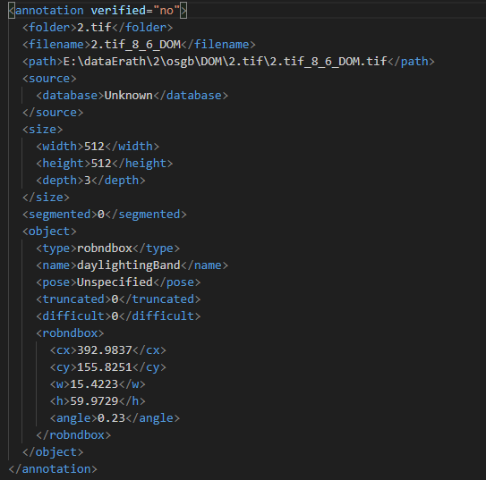
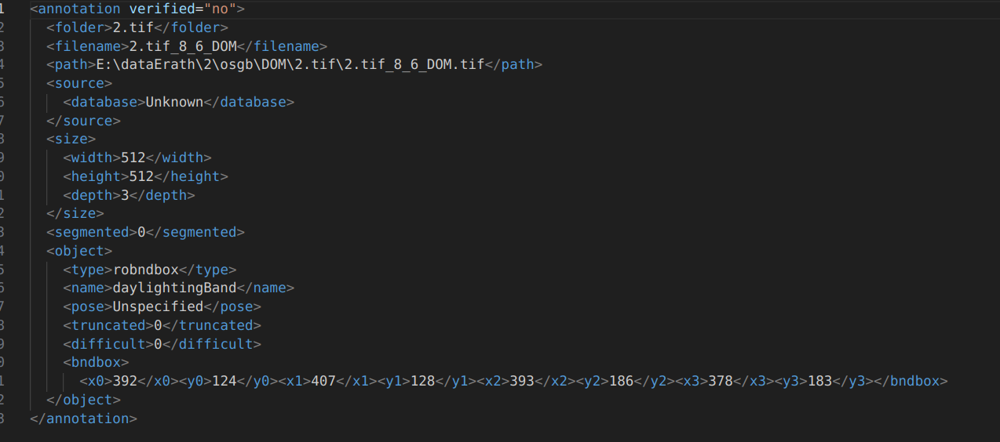
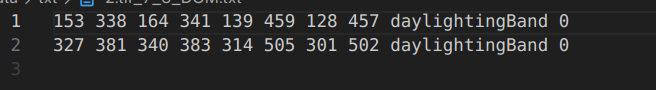
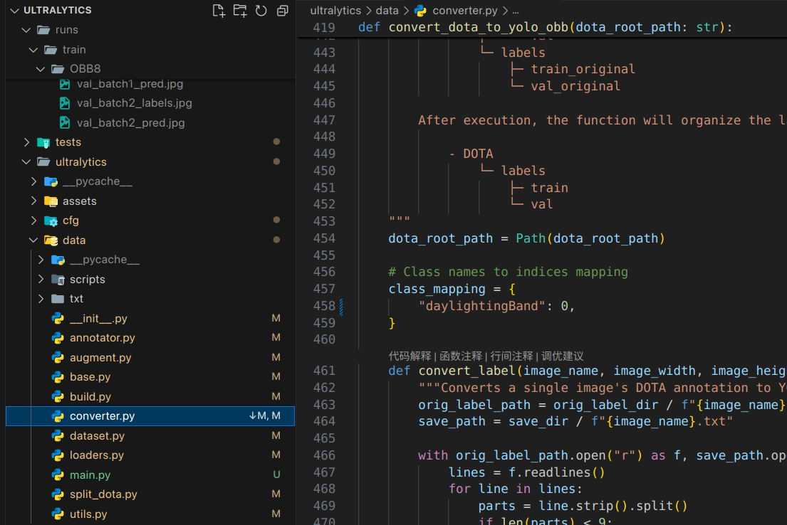
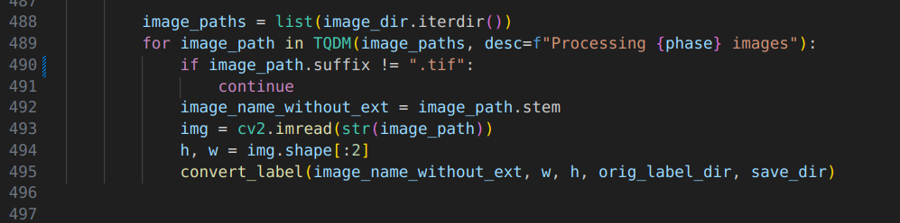
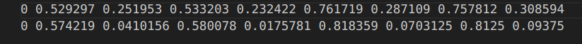
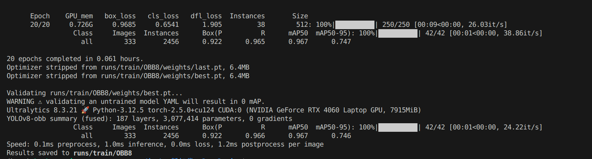

# 将rolableImg工具标注的图像转换可供yolo进行训练的格式

## 1. 数据集准备与矫正

关于roLabelImg标注工具的使用可以参考这个博客： [旋转标注工具rolabelImg使用教程](https://blog.csdn.net/qq_41672428/article/details/107690102)。

标注之后会生成xml格式的标注文件，内容如下所示： 


其中cx， cy表示目标框的中心点坐标，w, h表示目标框的宽和高。angle表示目标框的旋转角度。

在本项目中的./utils/dataPrePare中提供了： 
- 中文路径转换问题
- 数据比较

## 2. 格式转换

> label文件格式转换的逻辑是：
> - 先将格式转换为obb检测通用数据集DOTA数据集（类似COCO数据集在目标检测的地位）的xml格式，
> - 再转换为txt形式的DOTA数据集格式
> - 再通过yolov8中自带的转换脚本，将DOTA数据集格式转换为yolov8的txt格式。

（1） 可以通过运行./utils/xml_2_dota.py将rolabelImg的xml转换成dota数据集对应的xml格式。  
```python
# 功能描述   ：把rolabelimg标注的xml文件转换成dota能识别的xml文件，
#             再转换成dota格式的txt文件
#            把旋转框 cx,cy,w,h,angle，或者矩形框cx,cy,w,h,转换成四点坐标x1,y1,x2,y2,x3,y3,x4,y4
import os
import xml.etree.ElementTree as ET
import math
 
cls_list = ['daylightingBand']  # 修改为自己的标签
 
 
def edit_xml(xml_file, dotaxml_file):
    """
    修改xml文件
    :param xml_file:xml文件的路径
    :return:
    """
 
    # dxml_file = open(xml_file,encoding='gbk')
    # tree = ET.parse(dxml_file).getroot()
 
    tree = ET.parse(xml_file)
    objs = tree.findall('object')
    for ix, obj in enumerate(objs):
        x0 = ET.Element("x0")  # 创建节点
        y0 = ET.Element("y0")
        x1 = ET.Element("x1")
        y1 = ET.Element("y1")
        x2 = ET.Element("x2")
        y2 = ET.Element("y2")
        x3 = ET.Element("x3")
        y3 = ET.Element("y3")
        # obj_type = obj.find('bndbox')
        # type = obj_type.text
        # print(xml_file)
 
        if (obj.find('robndbox') == None):
            obj_bnd = obj.find('bndbox')
            obj_xmin = obj_bnd.find('xmin')
            obj_ymin = obj_bnd.find('ymin')
            obj_xmax = obj_bnd.find('xmax')
            obj_ymax = obj_bnd.find('ymax')
            # 以防有负值坐标
            xmin = max(float(obj_xmin.text), 0)
            ymin = max(float(obj_ymin.text), 0)
            xmax = max(float(obj_xmax.text), 0)
            ymax = max(float(obj_ymax.text), 0)
            obj_bnd.remove(obj_xmin)  # 删除节点
            obj_bnd.remove(obj_ymin)
            obj_bnd.remove(obj_xmax)
            obj_bnd.remove(obj_ymax)
            x0.text = str(xmin)
            y0.text = str(ymax)
            x1.text = str(xmax)
            y1.text = str(ymax)
            x2.text = str(xmax)
            y2.text = str(ymin)
            x3.text = str(xmin)
            y3.text = str(ymin)
        else:
            obj_bnd = obj.find('robndbox')
            obj_bnd.tag = 'bndbox'  # 修改节点名
            obj_cx = obj_bnd.find('cx')
            obj_cy = obj_bnd.find('cy')
            obj_w = obj_bnd.find('w')
            obj_h = obj_bnd.find('h')
            obj_angle = obj_bnd.find('angle')
            cx = float(obj_cx.text)
            cy = float(obj_cy.text)
            w = float(obj_w.text)
            h = float(obj_h.text)
            angle = float(obj_angle.text)
            obj_bnd.remove(obj_cx)  # 删除节点
            obj_bnd.remove(obj_cy)
            obj_bnd.remove(obj_w)
            obj_bnd.remove(obj_h)
            obj_bnd.remove(obj_angle)
 
            x0.text, y0.text = rotatePoint(cx, cy, cx - w / 2, cy - h / 2, -angle)
            x1.text, y1.text = rotatePoint(cx, cy, cx + w / 2, cy - h / 2, -angle)
            x2.text, y2.text = rotatePoint(cx, cy, cx + w / 2, cy + h / 2, -angle)
            x3.text, y3.text = rotatePoint(cx, cy, cx - w / 2, cy + h / 2, -angle)
 
        # obj.remove(obj_type)  # 删除节点
        obj_bnd.append(x0)  # 新增节点
        obj_bnd.append(y0)
        obj_bnd.append(x1)
        obj_bnd.append(y1)
        obj_bnd.append(x2)
        obj_bnd.append(y2)
        obj_bnd.append(x3)
        obj_bnd.append(y3)
 
        tree.write(dotaxml_file, method='xml', encoding='utf-8')  # 更新xml文件
 
 
# 转换成四点坐标
def rotatePoint(xc, yc, xp, yp, theta):
    xoff = xp - xc
    yoff = yp - yc
    cosTheta = math.cos(theta)
    sinTheta = math.sin(theta)
    pResx = cosTheta * xoff + sinTheta * yoff
    pResy = - sinTheta * xoff + cosTheta * yoff
    return str(int(xc + pResx)), str(int(yc + pResy))
 
 
def totxt(xml_path, out_path):
    # 想要生成的txt文件保存的路径，这里可以自己修改
 
    files = os.listdir(xml_path)
    i = 0
    for file in files:
 
        tree = ET.parse(xml_path + os.sep + file)
        root = tree.getroot()
 
        name = file.rsplit('.', 1)[0]
 
        output = out_path + '\\' + name + '.txt'
        file = open(output, 'w')
        i = i + 1
        objs = tree.findall('object')
        for obj in objs:
            cls = obj.find('name').text
            box = obj.find('bndbox')
            x0 = int(float(box.find('x0').text))
            y0 = int(float(box.find('y0').text))
            x1 = int(float(box.find('x1').text))
            y1 = int(float(box.find('y1').text))
            x2 = int(float(box.find('x2').text))
            y2 = int(float(box.find('y2').text))
            x3 = int(float(box.find('x3').text))
            y3 = int(float(box.find('y3').text))
            if x0 < 0:
                x0 = 0
            if x1 < 0:
                x1 = 0
            if x2 < 0:
                x2 = 0
            if x3 < 0:
                x3 = 0
            if y0 < 0:
                y0 = 0
            if y1 < 0:
                y1 = 0
            if y2 < 0:
                y2 = 0
            if y3 < 0:
                y3 = 0
            for cls_index, cls_name in enumerate(cls_list):
                if cls == cls_name:
                    file.write("{} {} {} {} {} {} {} {} {} {}\n".format(x0, y0, x1, y1, x2, y2, x3, y3, cls, cls_index))
        file.close()
        # print(output)
        print(i)
 
 
if __name__ == '__main__':
    # -----**** 第一步：把xml文件统一转换成旋转框的xml文件 ****-----
    roxml_path = './data/xml' # 存放roLabelImg标注的原文件的文件夹
    dotaxml_path = './data/xml2' # 存放转换后DOTA数据集xml格式文件的文件夹
    out_path = './data/txt' # 存放转换后DOTA数据集txt格式文件的文件夹
    filelist = os.listdir(roxml_path)
 
    for file in filelist:
        edit_xml(os.path.join(roxml_path, file), os.path.join(dotaxml_path, file))
 
    # -----**** 第二步：把旋转框xml文件转换成txt格式 ****-----
    totxt(dotaxml_path, out_path)
```

下图为dota数据集的xml格式与rolabelImg的区别是它记录的是`矩形框4个顶点`的坐标。


（2） 接下来是dota数据集的txt格式。

前8个是矩形框4个顶点的(x, y)坐标， 第九个是类别标注信息， 最后一个是类别对应的序号。

（3） 调用yolov8自带的数据集格式转换脚本（路径为项目文件夹下ultralytics/data/converter.py），在调用前需要对脚本做一些改动。


- 如图中所示将class_mapping中更为自己的类别名称。
- 修改图片格式为自己的图片格式（我的是.tif）,如下图所示



（4） 在存放DOTA txt格式标签文件的文件夹中，将转换好的标签文件分为train_original和val_original两个文件夹，放入对应的标签。运行一下代码调用脚本。需要注意把当前环境的ultralytics包卸载，否则会调用到site-packages中的脚本导致改动失效，并且这个脚本需要放在ultralytics的同级目录下。

```python
import sys
 
sys.path.append(r'C:\Users\Administrator\ultralytics')
from ultralytics.data.converter import convert_dota_to_yolo_obb
convert_dota_to_yolo_obb(r'C:\Users\Administrator\datasetCreation\data\data_enhancement') # DOTA txt格式标签文件存放路径
```

`注意：`   data_enhancement文件夹下的数据集结构如下图所示   
```python
└─data_enhancement
    ├─images
    |   | train
    |   | test
    |   └─val
    |
    └─labels
        | train
        | train_original
        | val
        | val_original
        └─test
```
运行之后，在data_enhancement/labels文件夹中会产生train和val两个文件夹，里面存放了转换好的yolov8格式标签文件，形式如下。

  
第一个为类别序号信息， 剩余8个是矩形框4个顶点坐标。 至此就可以将数据集用于训练了

（5） 配置yaml文件， 新建yolov8-obb_1.yaml，放在哪里都可以。
```python
# dataset path
path: path/to/dataset
train: ./dataset/images/train
val: ./dataset/images/val
test: ./dataset/images/test 
 
# number of classes
nc: x
 
# class names
names: ['自己的类别']
```

（6） 运行train.py开始训练
```python
import warnings
warnings.filterwarnings('ignore')
from ultralytics import YOLO
 
if __name__ == '__main__':
    model = YOLO('ultralytics/ultralytics/cfg/models/v8/yolov8-obb.yaml').load('/media/hz/新加卷/ultralytics/runs/train/OBB7/weights/last.pt')
    # model.load('yolov8n.pt') # loading pretrain weights
    model.train(data='datasetCreation/datasetCreation/data/datatxt/yolov8-obb_1.yaml',
                cache=False,
                imgsz=512,
                epochs=20,
                batch=8,
                close_mosaic=10,
                device='0',
                optimizer='SGD', # using SGD
                # resume= True, # last.pt path
                # amp=False, # close amp
                # fraction=0.2,
                project='runs/train',
                name='OBB',
                )
```

成功


## 3. 数据增强

